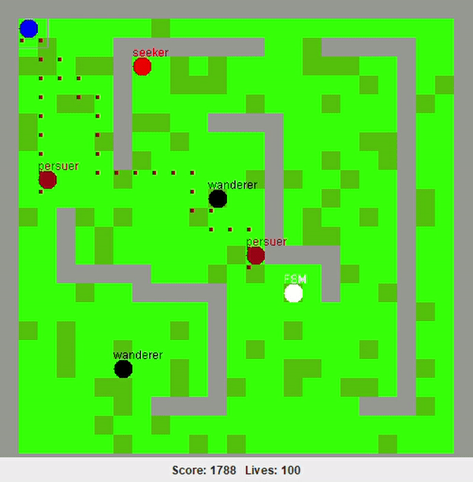

[![LinkedIn][linkedin-shield]][linkedin-url]

<!-- PROJECT LOGO -->
 

  <h3 align="center">AI Game</h3>

  

   A game with multiple AI enemies. 
     
  

<!-- TABLE OF CONTENTS -->

  
Table of Contents

  <ol>
    <li>
      <a href="#about-the-project">About The Project</a>
      <ul>
        <li><a href="#built-with">Built With</a></li>
      </ul>
    </li>
    <li><a href="#license">License</a></li>
  </ol>

<!-- ABOUT THE PROJECT -->
## About The Project

This was a second year assignment for the AI in games module. The module was focused on the concepts involved in game design particularly involving AI in games; such as 
procedural generation, playability, artificial stupidity etc etc.

This games enemies are:
* The wanderer: This enemy just moves around aimlessly in random directions
* The Finite state machinist: This fella is chill most of the game, but if his goons arent getting the job done in time, it wakes up starts wandering, then seeking, then persuing and eventually gets tired and rest before repeating. 
* The persuer: These guys persue using the astar algorithm.
* The seeker: The seekers just follow you but they are too dumb to go aroung walls like the persuers.

The blue ball is the player. The aim of the game is to stay alive. When the other ball catch you, you lose lives. This game cannot be won (its like tetris), you can only obtain a higher score.

The difficulty can be adjusted by changing number of lives and speed of enemies.

For more details on how I developed this game have a look at my blog [zibibytes.](https://zebibytes.blogspot.com/)

The blog was part of the assignment to explain the project.

### Built With

Built with good old [Java](https://www.java.com/en/)

<!-- LICENSE -->
## License

Distributed under the MIT License. See `LICENSE` for more information.

<!-- CONTACT -->
## Contact

Linda Scoon - [@linda_scoon](https://twitter.com/linda_scoon) - Twitter

<!-- MARKDOWN LINKS & IMAGES --> 
[linkedin-shield]: https://img.shields.io/badge/-LinkedIn-black.svg?style=for-the-badge&logo=linkedin&colorB=555
[linkedin-url]: https://www.linkedin.com/in/linda-scoon/
